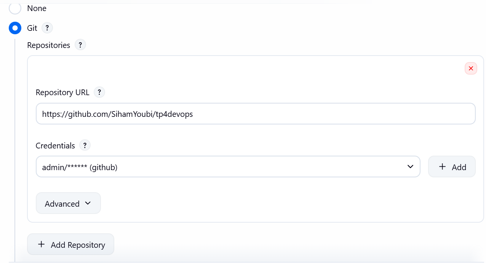
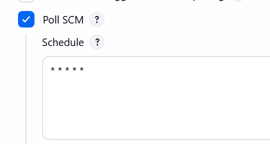
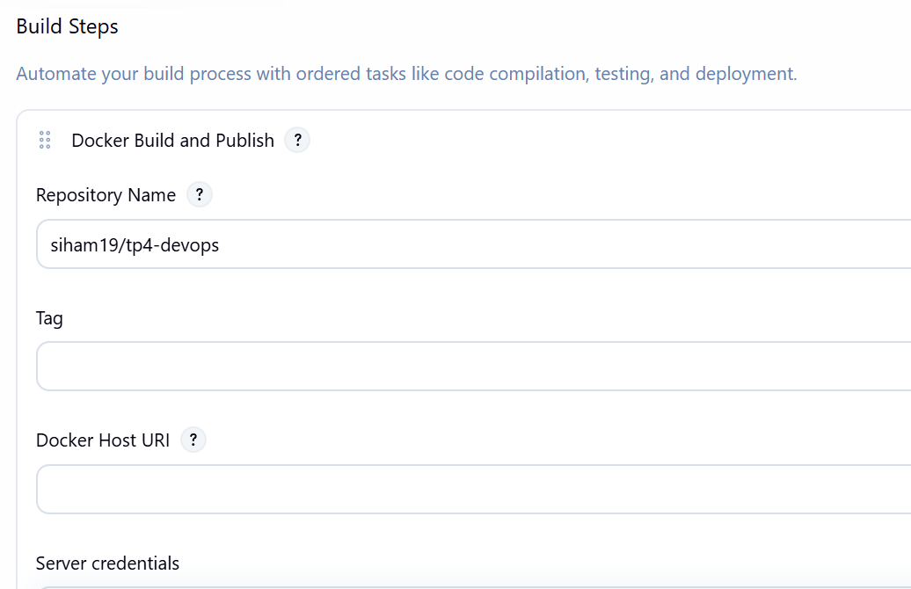
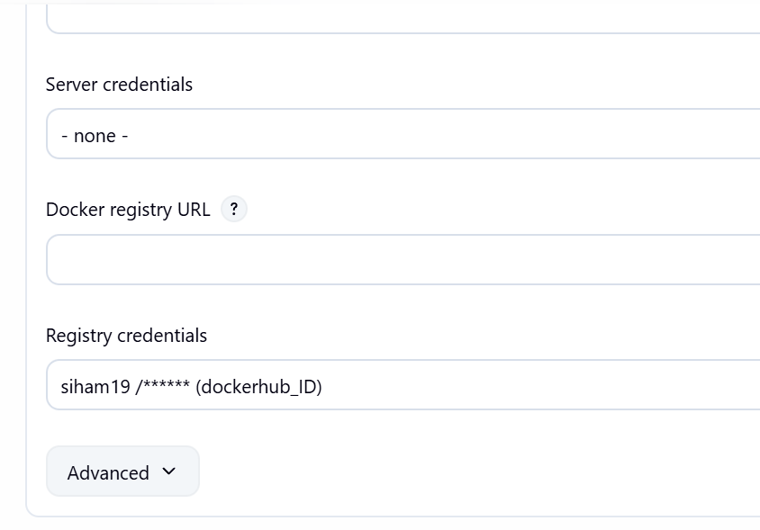
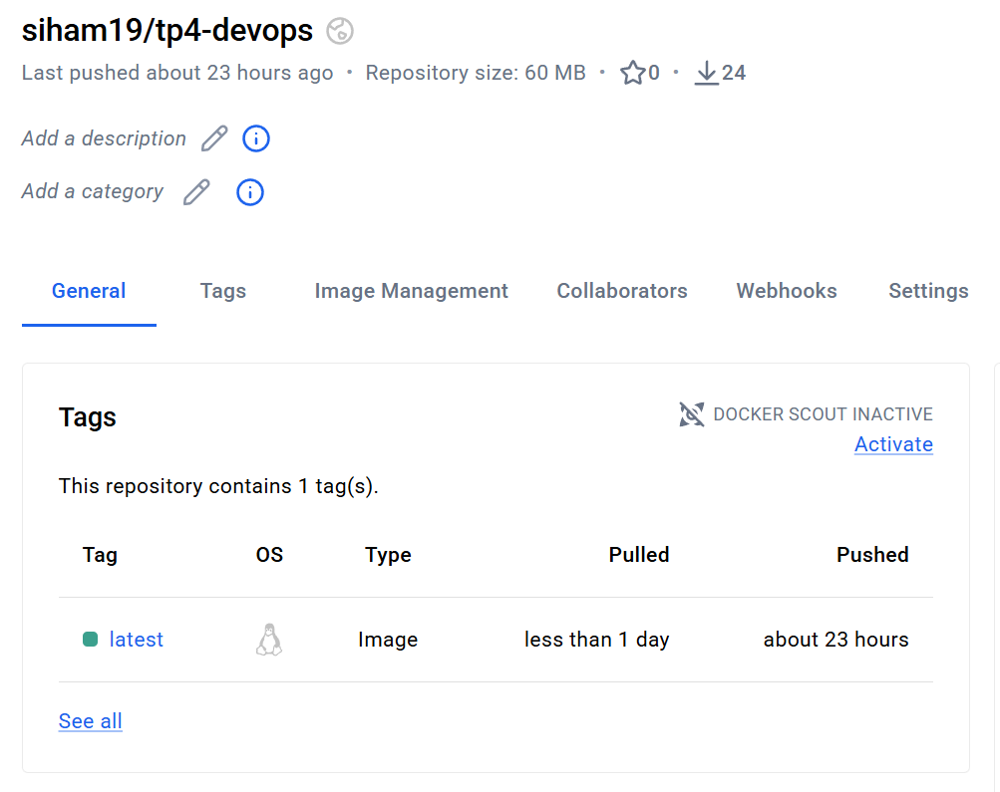
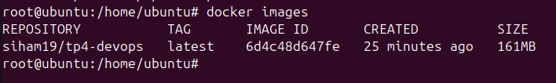
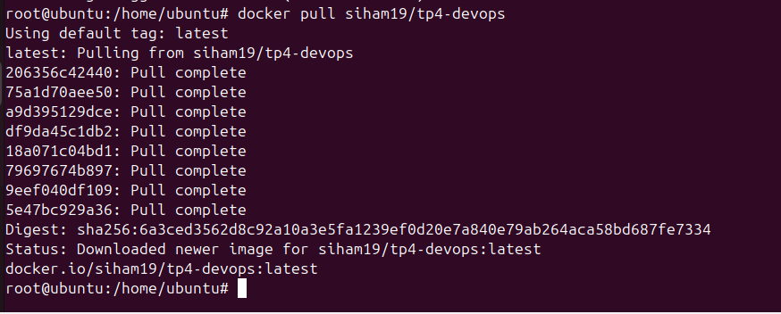

#  DevOps — CI/CD Pipeline avec Jenkins, Docker & GitHub

##  Description

Ce projet met en place un pipeline CI/CD complet permettant de :
1. Récupérer automatiquement le code source depuis **GitHub**
2. Construire une image **Docker** (basée sur nginx)
3. Pousser l'image vers **Docker Hub**
4. Déployer et tester l'image sur une machine **Ubuntu**

---

##  Technologies utilisées

| Outil | Rôle |
|-------|------|
| Jenkins | Serveur d'intégration continue (CI/CD) |
| Docker | Conteneurisation de l'application |
| GitHub | Hébergement du code source |
| Docker Hub | Registry d'images Docker |
| Nginx | Serveur web dans le conteneur |
| Ubuntu | Machine de déploiement |

---

##  Configuration Jenkins

### Source Code Management 

Le job Jenkins est configuré pour surveiller le repository GitHub :

- **Repository URL** : `https://github.com/SihamYoubi/tp4devops`
- **Credentials** : `github`
- **Branch** : `*/master`



---

### Déclenchement automatique — Poll SCM

Le job se déclenche automatiquement à chaque modification du code grâce à **Poll SCM** :

- **Schedule** : `* * * * *` (toutes les minutes)



---

### Build Step — Docker Build and Publish

Le build step publie l'image Docker sur Docker Hub :

- **Repository Name** : `siham19/tp4-devops`
- **Registry credentials** : `siham19/****** (dockerhub_ID)`




---

##  Docker Hub

L'image est disponible publiquement sur Docker Hub :

🔗 **[siham19/tp4-devops](https://hub.docker.com/r/siham19/tp4-devops)**




---

##  Déploiement sur Ubuntu

### Vérification de l'image localement

```bash
docker images
```



---

### Pull et déploiement depuis Docker Hub

```bash
docker pull siham19/tp4-devops
```




